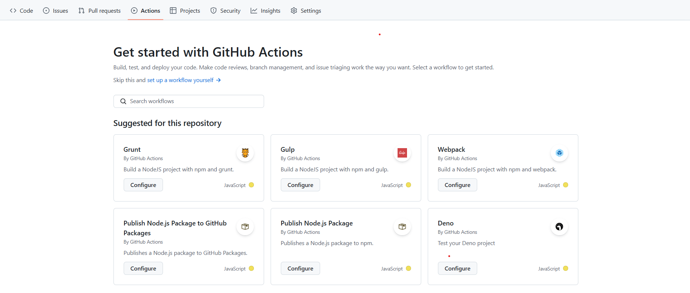
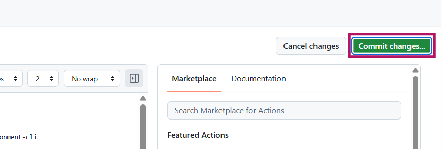
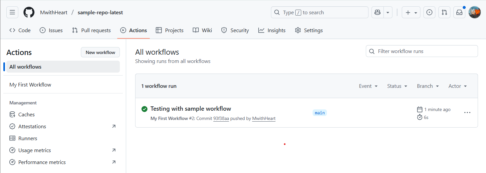

# Getting started
## Set up your first GitHub Actions workflow
A GitHub Actions workflow automates tasks in your repository. Workflows are written as YAML files and stored in: ```.github/workflows/```.  
There are two main ways to create a workflow:  
## Option 1: Use starter workflows
GitHub provides ready-made templates you can customize. 
1. Open your repository on GitHub.
2. Go to the Actions tab. You’ll see a list of suggested workflows.  

      

3. You can search for workflows with keywords or filter by category. 
4. Select the workflow you want and click **Configure**. GitHub will open the workflow in an editor. 
5. Follow any setup notes in the comments. Some workflows use secrets e.g. ```${{ secrets.npm_token }}```. For more information, see [using secrets in GitHub Actions](https://docs.github.com/en/actions/how-tos/write-workflows/choose-what-workflows-do/use-secrets).
6. Customize the template as much as you want. 
7. Once done, click **Commit Changes.** This automatically creates a file in: ```.github/workflows/<workflow-name>.yaml```  

    
---

:::tip  
This is the fastest way to get started. You can still edit the workflow file later.  
:::


## Option 2: Create workflows manually
If you want to write a workflow from scratch:
1. In your project folder, create the folders: ```.github/workflows```. This will create two folders: ```.github``` and ```workflows```.
2. In ```workflows```, create a file named ```hello.yaml```.
3. In the ```hello.yaml``` file, paste the following code. 

```
    name: My First Workflow  # Just a name for your workflow

    on: 
    push:       # "Trigger" - when should this workflow run?
        branches: 
        - main  # Run only when new code is pushed to the "main" branch

    jobs:
      print-hello:  # This is the name of our job
        runs-on: ubuntu-latest  # GitHub gives us a free computer with Ubuntu installed

        steps:
          - name: Print a message  # Name of the step
            run: echo "Hello, I’m testing GitHub Actions!"  # What to do: print a message
```

### Test your workflow
1. Open the VS Code terminal and run the following commands:
    ```
    git add . 
    git commit -m “Type commit message here”
    git push
    ```

2. Go to GitHub and click the actions tab. You should see a new workflow run like this:  

    

If the job shows a green tick, the workflow worked.

### Breakdown of the workflow
| Section                      |   Explanation     |   
| ---------                    | ----------------- |
| `name:My First Workflow` | The label used to identify your workflow. |
| ```on:```                    | Defines the trigger. Here, it runs every time you upload (push) code the main branch. |
| ```jobs:```                  | A group of tasks that run together. Here, we have one job (print-hello). |
| ```runs-on:```               | The type of virtual machine (runner) GitHub provides. Here, it is ubuntu-latest. It will run regardless of the Operating System of your local machine. |
| `steps:`                 | Inside a job, you list all the things you want to do. Here, there’s just one step: print a message. |
| ```run: echo "Hello, GitHub Actions!"``` | This is the command to run. In this case, it prints the text “Hello, GitHub Actions!” to the console. |


:::tip 📝 Pro tip  
You can create multiple workflows in the same repository for different tasks (testing, deployment, notifications, etc.).  
:::

### The result
In the actions tab:
- The left panel will show your workflow name (My First Workflow).
- The label will be the commit message you used.
- When you click the label, you should see a single job (print-hello) that completed successfully.  

      

Now you understand the structure of a GitHub Action workflow.
