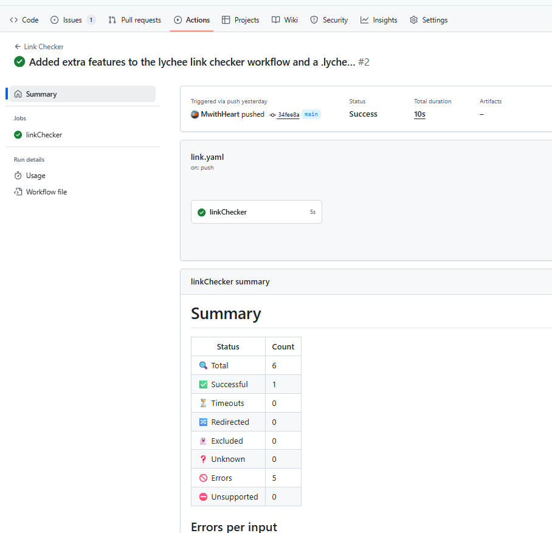
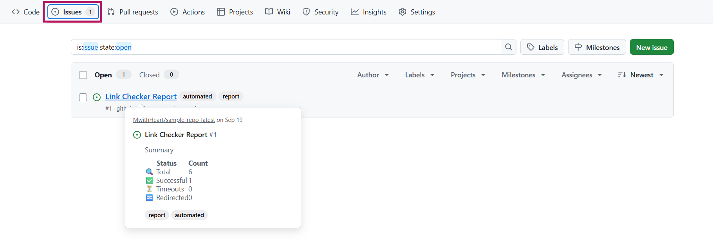

# Example: Using Lychee Link Checker
:::tip  
You can explore many prebuilt workflows on the [GitHub Actions Marketplace](https://github.com/marketplace?type=actions).     
:::  

This section explains how to set up a real CI/CD pipeline using the Lychee Link Checker. This automatically checks your repository for broken links every time you push or open a pull request.

1. In your project, create a file named ```links.yaml``` in the folder ```.github/workflows```. 
2. Copy the following workflow code into ```links.yaml```. You can find it in the Lychee Link Checker README file.

    ```
    name: Links

    on:
        repository_dispatch:
        workflow_dispatch:
        schedule:
            - cron: "00 18 * * *"

    jobs:
        linkChecker:
            runs-on: ubuntu-latest
            permissions:
                issues: write # required for peter-evans/create-issue-from-file
            steps:
              - uses: actions/checkout@v4

              - name: Link Checker
                id: lychee
                uses: lycheeverse/lychee-action@v2
                with:
                  fail: false

        - name: Create Issue From File
          if: steps.lychee.outputs.exit_code != 0
          uses: peter-evans/create-issue-from-file@v5
          with:
            title: Link Checker Report
            content-filepath: ./lychee/out.md
            labels: report, automated issue    
    ```

:::note  
It is important to read README files properly as they contain important information.  
:::


## Key terms & parameters

| Term                  | Explanation                       | 
| ------------------    | ------------------------      | 
| Action    | A reusable automation published on GitHub Marketplace. Example: ```lycheeverse/lychee-action``` |
| `args` | Command-line flags passed to Lychee. Examples: `--base .', './**/*.md` |
| `schedule` | A trigger to run the workflow on a timer. Example: Daily at midnight (`cron: '0 0 * * *'`) |
| `workflow_dispatch` | A trigger that allows manual runs from GitHub UI. |
| `permissions: issues: write` | Allows the workflow to create issues in your repo. It is required for ```create-issue-from-file``` |
| `actions/checkout@v4` | Checks out the repo so the workflow can access files. It is the first step in most workflows | 
| `id: lychee` | Names this step so later steps can use its output The step was referenced as `steps.lychee.outputs.exit_code` |
| `fail: false` | The job won’t fail even if broken links are found. It is recommended to keep it as false especially for big repos |
| `output` | The file path where report is written. Example: `lychee/out.md` |
| `with` | Used to add parameters and other key things that you want to include such as settings. The parameters under `with` are known as flags or inputs. They are listed under Parameters in the README file. Examples: `args`, `format`, `output`. |


## Tweaked workflow
Here’s a slightly modified version of the official README workflow:  
```
    name: Link Checker

    on:
      push:
        branches: [ main ]
      pull_request:

    jobs:
      linkChecker:
        runs-on: ubuntu-latest
        permissions:
          issues: write          # needed if you want to create issues from failures
        steps:
          - name: Checkout repo
            uses: actions/checkout@v4

          - name: Run lychee
            id: lychee
            uses: lycheeverse/lychee-action@v2
            with:
              args: --base . --verbose --no-progress './**/*.md' './**/*.html'
              format: markdown
              output: lychee/out.md
              fail: false    # don't fail the job — we'll create an issue instead

          - name: Create Issue From File
            if: steps.lychee.outputs.exit_code != 0
            uses: peter-evans/create-issue-from-file@v5
            with:
              title: Link Checker Report
              content-filepath: ./lychee/out.md
              labels: report, automated

```


Try to understand the code yourself before reading the explanation below: 

### Breakdown of the tweaked workflow
- The workflow name is `Link Checker`.
- The actions that trigger the workflow are:
    - A push request to the main branch.
    - A pull request.
- The job in this workflow is `linkchecker`.
- The virtual machine used is `Ubuntu latest`.
- `Permissions: issues: write` This is set to write so that Lychee creates an issue from failed links.
- The first step in the job is to checkout repo using the action `actions/checkoit@V4`.
- The second step is to run lychee using the official Lychee Action `lycheeverse/lychee-action@v2`.
- The link checker checks `./**/*.md` and `./**/*.html`.
- It writes a report to the output `lychee/out.md` using markdown format.
- `fail: false` means the action won’t make the whole job fail since we’re creating issues instead.
- The second step cereates an issue when broken links are found. Lychee sets an exit_code output (non-zero) if there are broken links.
- It then creates an issue containing `lychee/out.md. 
- `peter-evans/create-issue-from-file` is a GitHub Action designed to create a new issue in a repository using the content from a specified file. 

## To ignore links
1. Create a `.lycheeignore` file in the repo root. 
2. Add one regex per line for links you want to ignore. Example:  

    ```
    # Ignore LinkedIn links
    https://(www\.)?linkedin\.com\/.*

    # Ignore Dribble links
    https://(www\.)?dribble\.com\/.*


    # Ignore Substack links
    https://(www\.)?substack\.com\/.*
    ```

3. Save file and push to github. 
4. Click the **Actions** tab. You should have something like this:  

      

5. On the issues tab, you should have something like this:  

     .

6. Click the issue name to see the summary generted by the Lychee broken link checker.  


:::tip  
If you run lychee in a subdirectory, place .lycheeignore in that directory and set workingDirectory in the action to match.  
:::


