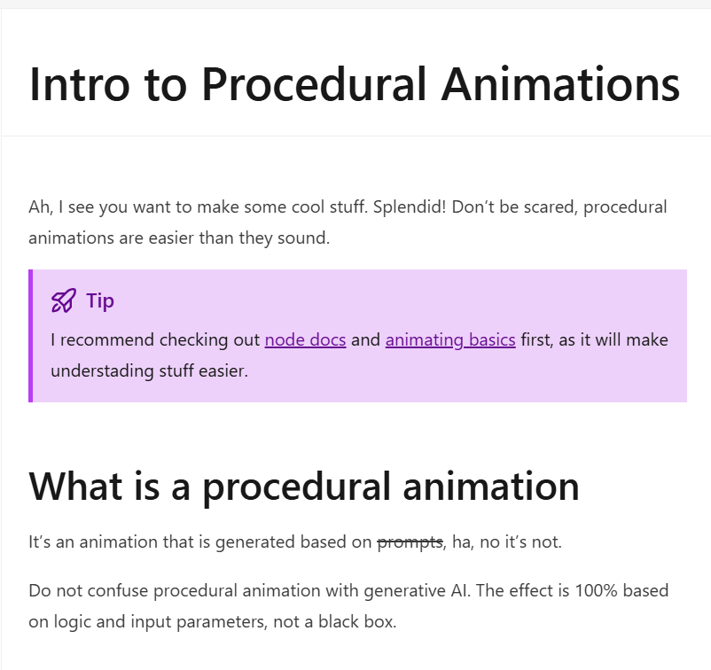
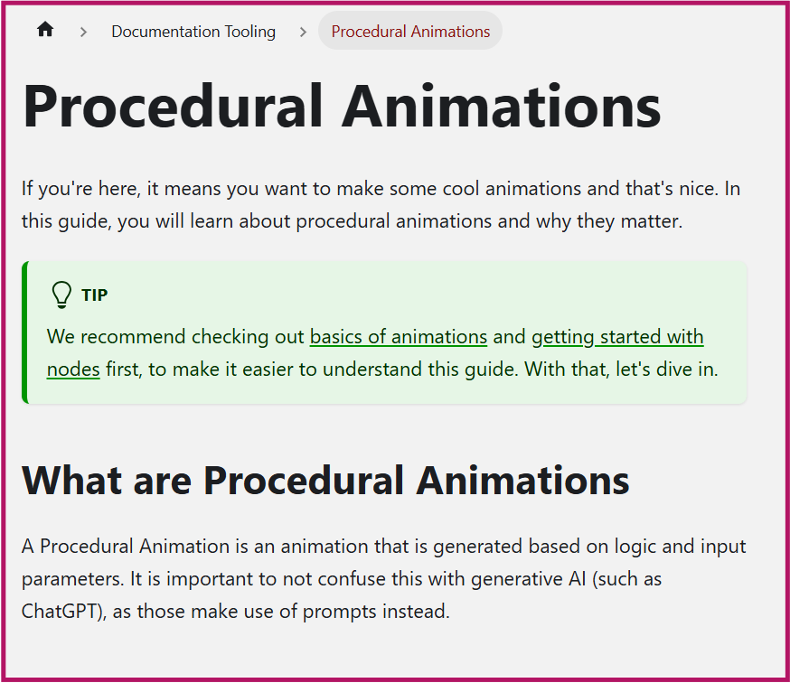
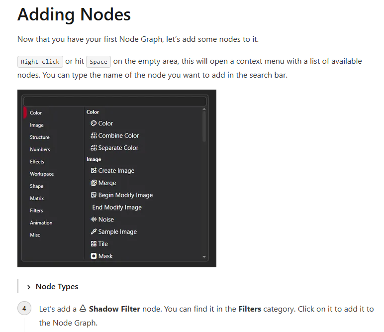
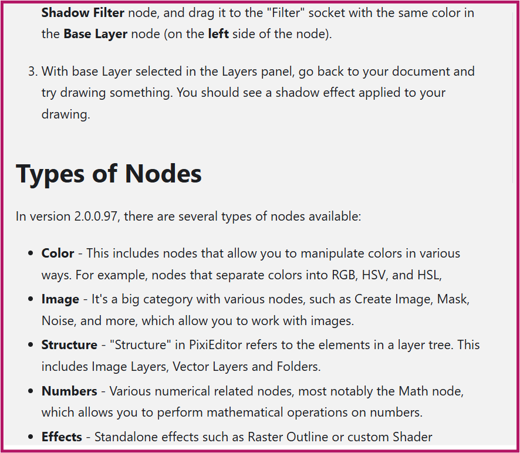
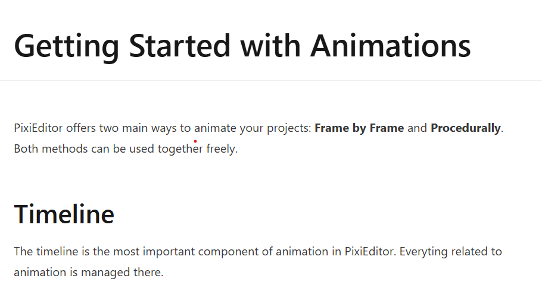
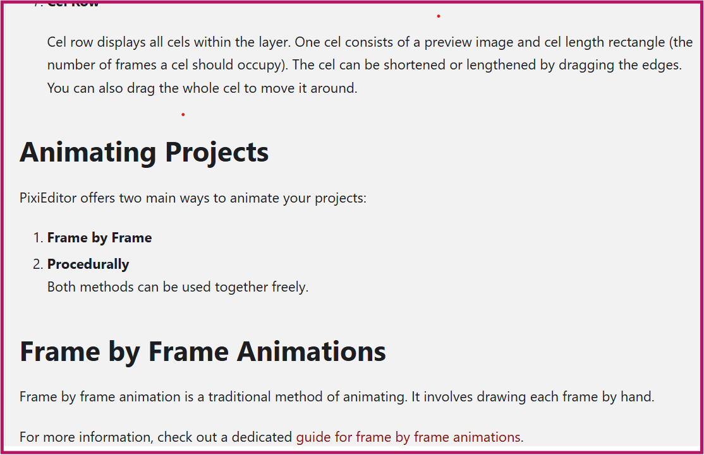

# Documentation tooling overview 
This project involved auditing and restructuring documentation for PixiEditor using Docusaurus.

## PixiEditor
PixiEditor is a free, opensource Universal 2D editor that allows users to create pixel art, vector graphics and animations in 2D.  
You can check the live site [here](https://pixieditor.net).

## Improved pages
- **Getting Started:** Introduces users to the basics of animations
- **Create a Node Graph:** Guides users on how create their first Node Graph in PixiEditor.
- **Procedural Animations:** Step-by-step guide on how to create procedural animations

:::tip  Improvements made  
📝 Improved tone  
📝 Clearer steps  
📝 Restructured long, confusing paragraphs

:::

1. The tone and comprehensiveness of the **Procedural Animations** page. As well as the consistency of terms used and the headings.  
 
**Example improvement:** 
- **Previous**:

- **New**: 
  

2. I restructured confusing paragraphs and made them easier to understand. In the image below, the **Node Type** was added as a summary in the middle of a list.   
I moved it below the list and brought it out as a separate heading instead of a collapsible summary that readers can easily overlook.  
**Example improvement:** 
- **Previous**: 

- **New**:  
  

3. I noticed information on the [Getting started with animations](docs/documentation-tooling/getting-started.md) page was scattered and confusing so I grouped similar information.  

**Example improvement**  

- **Previous**:  

- **New**:  
  
  

## Challenges
- It was challenging choosing an open source project in the first place. 
- Restructuring documentation while ensuring it is beginner-friendly. 

## Key takeaways
- I learnt how important consistency is in documentation. 
- I learnt to implement the docs-as-code workflow.

