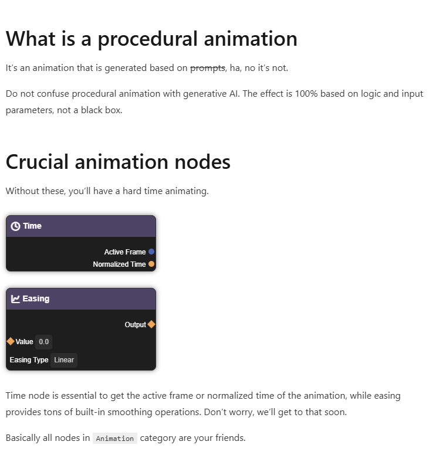
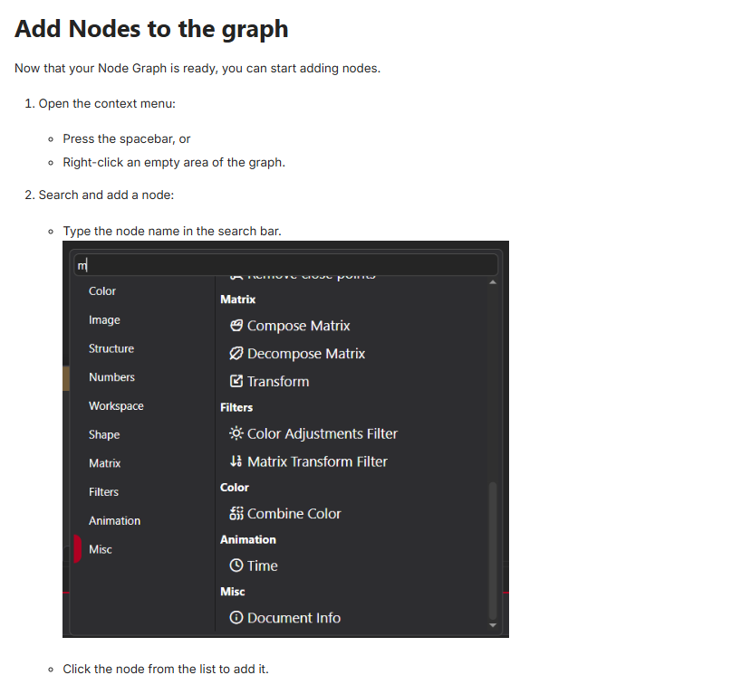
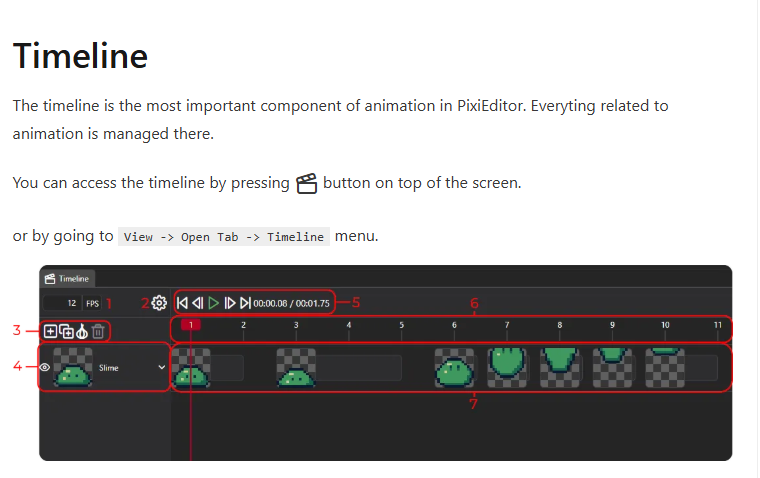
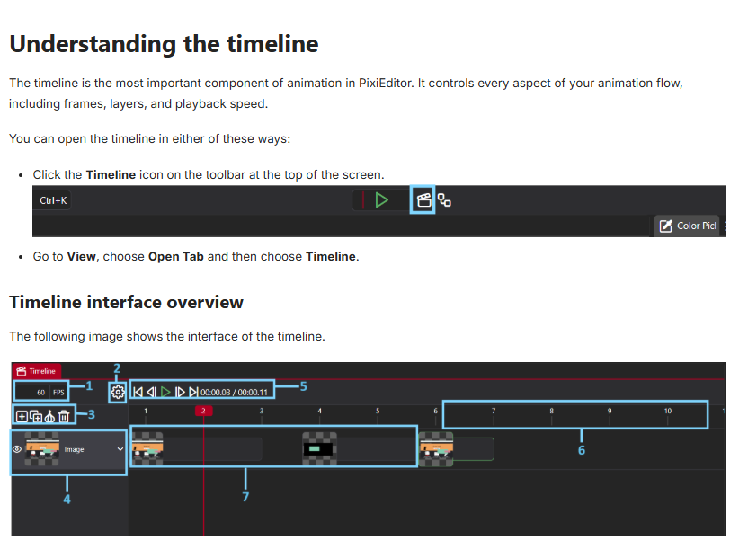

# Documentation Tooling Project (PixiEditor)
This project involved auditing and restructuring documentation for PixiEditor using Docusaurus.

## Live Site
[PixiEditor](https://pixieditor.net) site

## What I Improved
1. The tone and comprehensiveness of the **Procedural Animations** page. As well as the consistency of terms used and the headings.  
**Example improvement:** 
- **Previous**:

- **New**: 
  

2. I restructured paragraphs and made them easier to understand. In the image below, the **Node Type** was added as a summary in the middle of a list. I moved it below the list and brough it out as a separate heading instead of a collapsible summary that readers can easily overlook.
**Example improvement:** 
- **Previous**: 

- **New**:  
  

3. I noticed information on the [Getting started with animations](docs/documentation-tooling/getting-started) page was slightly scattered so I grouped similar information.  

**Example improvement**  

- **Previous**:  

- **New**:  
  

  

## Challenges
- It was challenging choosing an open source project in the first place. 
- Getting the icons used in the actual documentation was difficult as pixiEditor made use of Asro framework which I do not have much knowledge of. 

## What I Learnt
- I learnt how important documentation is, all over again. I noticed some pages in the PixiEditor docs had probably been updated regarding tone and structure, while some had not.  
- 

