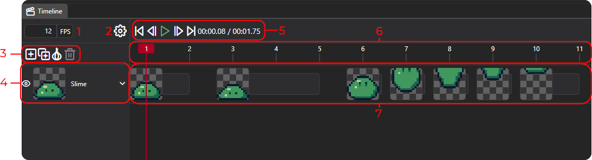

<!-- sidebar:
#   order: 1
#   badge:
  #   text: Start Here
   #  variant: tip
 -->

 <!-- import timelineImg from 'site/docs/docs-tooling-img/pix-editor-timeline'; 
import { Image } from '@site/static/img/pixi-editor-icons'; --->


# Getting started with animations
Welcome to PixiEditor. This guide explains some important concepts in animation as well as two main ways of animating your project. 

## Timeline 

The timeline is the most important component of animation in PixiEditor. The timeline manages everything related to animation.

You can access the timeline by either of these:
- Click the timeline icon on top of the screen.
- Go to `View -> Open Tab -> Timeline` menu.

### Components of the timeline
The image below shows the interface of the timeline.




1. **Frames per second (FPS)** - this is used to set how fast the timeline should play the animation. Higher values require more frames for the same amount of time, but produce smoother result.

    The usual values are:
    - 60 - for smooth animation, usually used in games
    - 24 - movie industry standard

<!--- 2. <span className="pixi-icon "/> **Settings** - opens a menu with timeline related-settings
2. <span className=" pixi-editor-icons icon-settings"/> **Settings** - opens a menu with timeline related-settings
2.  
--->


2. **Settings** - opens a menu with timeline related-settings


<!--- - <span className="pixi-icon icon-plus-square"/> - Adds an empty cel to the currently selected layer
- <span className="pixi-icon icon-duplicate"/> - Creates a duplicated cel to the currently selected layer. Duplicates the content under active frame.
- <span className="pixi-icon icon-onion"/> - Toggles on/off onion skinning
- <span className="pixi-icon icon-trash"/> - Deletes all selected cels 

4. **Layer**

    From the left to the right:

- <span className="pixi-icon icon-eye"/> - Makes the animation for the entire layer visible. It can be turned on or off
- Image Preview - It displays the layer's **base** image.
- Layer Name, which is Slime in the image above.
- <span className="pixi-icon icon-chevron-down"/> - The collapse button. It folds in the layer row with its animation, so it can take minimal space.

5. **Playback buttons**

- <span className="pixi-icon icon-step-start"/> - Moves the frame cursor backward to the edge of the closest cel.
- <span className="pixi-icon icon-step-back"/> - Moves the frame cursor back one frame.
- <span className="pixi-icon icon-play" style={{color: "#6fac6f"}}/> - Plays the animation
- <span className="pixi-icon icon-step-forward"/> - Moves the frame cursor forward one frame.
- <span className="pixi-icon icon-step-end"/> - Moves the frame cursor forward to the edge of the closest cel.
- `00:00.08/00:01.75` - This is the `current time` / `end time`. In the format `mm:ss.ff` format with `mm` - minutes, `ss` - seconds, `ff` - hundredths of a second.

 --->

3. **Action buttons**
- Plus Icon - Adds an empty cel to the currently selected layer
- Duplicate Icon- Creates a duplicated cel to the currently selected layer. Duplicates the content under active frame.
-  Onion Icon- - Toggles on/off onion skinning.
- Trash Icon-- Deletes all selected cels.

4. **Layer**

    From left to right:

- Eye Icon - Makes the animation for the entire layer visible. You can turn it on or off.
- Image Preview - It displays the layer's **base** image.
- Layer Name, which is Slime in the image above.
- Dropdown button - The collapse button. It folds in the layer row with its animation, so it can take minimal space.

5. **Playback buttons**

-  Step Start Icon- - Moves the frame cursor backward to the edge of the closest cel.
-  Step Back Icon- - Moves the frame cursor back one frame.
-  Play Icon-  - Plays the animation
-  Step Forward Icon- - Moves the frame cursor forward one frame.
- Step-End Icon- - Moves the frame cursor forward to the edge of the closest cel.
- ```00:00.08/00:01.75``` - This is the `current time` / `end time`. In the format `mm:ss.ff` format with `mm` - minutes, `ss` - seconds, `ff` - hundredths of a second.

6. **Frame Bar** 

    The frame bar is the top part of the timeline viewport. It is a slider. You can click and drag to change active frame. You can zoom in or out by scrolling over it.  
    It displays frame cursor, frame ticks and frame numbers.

7. **Cel Row**

    Cel row displays all cels within the layer. One cel consists of a preview image and cel length rectangle (the number of frames a cel should occupy). The cel can be shortened or lengthened by dragging the edges. You can also drag the whole cel to move it around.


## Animating projects
PixiEditor offers two main ways to animate your projects: 
1. **Frame by Frame** 
2. **Procedurally**  
Both methods can be used together freely.


## Frame by frame animations

Frame by frame animation is a traditional method of animating. It involves drawing each frame by hand.

For more information, check out a dedicated [guide for frame by frame animations](https://pixieditor.net/docs/usage/animating/frame-by-frame/). 

## Procedural animations

PixiEditor gives full freedom over animations, meaning you can animate almost any property within the [Node Graph](https://pixieditor.net/docs/usage/node-graph/getting-started-with-node-graph/). 
It doesn't involve any manual drawing, unlike frame by frame animations, rather it is a combination of operations and parameters.

Think of it as a set of instructions.

`Move to the right by 10 pixels over 1 second`

For more information, check out a dedicated [guide for procedural animation](https://pixieditor.net/docs/usage/animating/procedural/).
