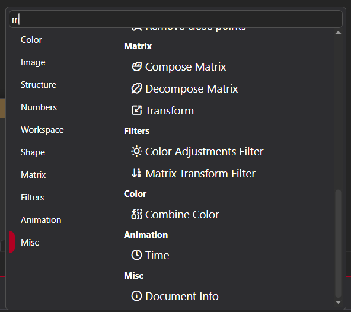

# Create a Node Graph in PixiEditor  
Welcome to Nodes.🎉 The Node system is a powerful way to build and control animations in a non-destructive, flexible workflow.    

:::caution
Node Graphs are available only in PixiEditor 2.0 and later versions. Ensure you are running a compatible version before continuing.
:::

## Create your first Node Graph

Before you start, we recommend reading [Getting Started with Nodes](https://pixieditor.net/docs/usage/node-graph/getting-started-with-node-graph/). It explains the basics of nodes and how they work.  

Follow these steps to create your first Node Graph:  

1. Go to **File** menu, then click **New** to create a new document in PixiEditor.
2. Open the **Graph View** by either of these methods:
    - Click the **Graph View** icon at the top center of the window.
    - Go to **View** menu, click **Open Tab** and click **Graph View**.
3. This shows a Node Graph with a single base layer connected to the Output Node. This is the starting point of the Node Graph.

---

## Add Nodes to the graph  

Now that your Node Graph is ready, you can start adding nodes.  

1. Open the context menu containing nodes:  
   - Press the spacebar, or  
   - Right-click an empty area of the graph.  

2. Search and add a node:  
   - Type the node name in the search bar.  
     

   - Click the node from the list to add it.  

---

### Example: Add a Shadow Filter node 
Let’s add a Shadow Filter node and connect it to the Base Layer: 

1.  Go to the **Filters** category and click **Shadow Filter** to add it to the node graph.  

2. Find the red circle ⬤ on the right side of the **Filter node** label.
3. Drag the circle to the matching red socket on the Base Layer node (on the left side). 

4. Select **Base Layer** in the Layers panel.
5. Draw on your document, you should see a shadow effect applied in real-time.

---

## Types of nodes

PixiEditor 2.0.0.97 includes several node categories: 

- Color - Includes nodes that work with colors.
- Image - Nodes such as create, mask, and those that manipulate images such as Noise, Mask.
- Structure - Represent elements in a layer tree like Image Layers, Vector Layers, and Folders.
- Numbers - Nodes that perform numerical operations. For example, Math node.  
- Effects - Apply visual effects such as Raster Outline or Custom Shader. 
- Workspace - Nodes for customizing outputs and exporting zones.
- Shape - Nodes allow you to create and manipulate shapes.
- Matrix - Matrix-related nodes like Transform.
- Filters - Apply effects like Blur, Shadow, and Color Correction with these nodes.
- Animation - Nodes for creating procedural animations.
- Misc - Miscellaneous nodes, such as Document Info.

---

## Understanding sockets

Nodes have colored sockets (circles or diamonds) on their sides. These are used to connect nodes together and transfer data between them.  

> To learn more, check [Property Sockets](https://pixieditor.net/docs/usage/node-graph/property-sockets/).

---

 