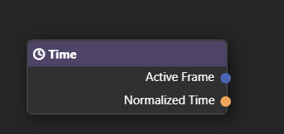
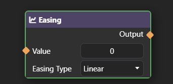
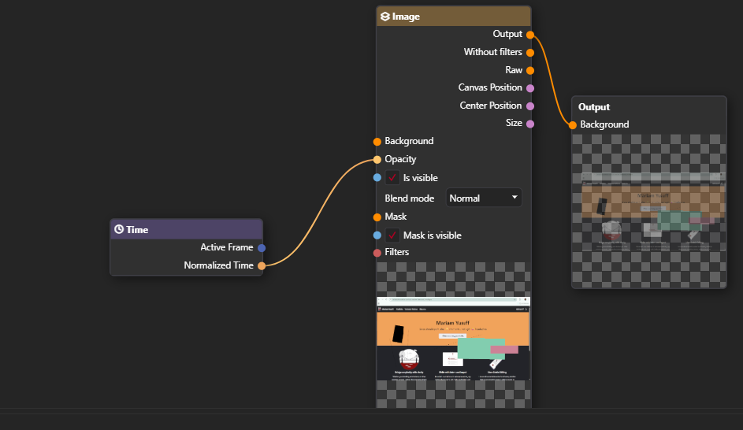

This guide introduces **procedural animations**, explains why they matter, and how to create both simple and complex animations using nodes.

:::tip  
Before diving in, you may find it helpful to review the [Basics of Animations](https://pixieditor.net/docs/usage/animating/getting-started/) and [Getting Started with Node Graphs](https://pixieditor.net/docs/usage/node-graph/getting-started-with-node-graph/) pages. 
:::

---

## What is Procedural animation

Procedural animation refers to animations that are generated based on logic and input parameters. It's important to not confuse this with generative AI (such as ChatGPT), as those make use of prompts instead.   

---

## Key animation nodes 

The following nodes are essential when working with procedural animations:  

- **Time node:** Provides the current position in the animation timeline. It exposes:
  - **Active Frame:** The current frame being displayed.
  - **Normalized Time;** A value between `0.0` (start of animation) and `1.0` (end of animation).  

     

- **Easing node** - Easing applies smooth transitions to animations, such as ease-in, ease-out, or elastic effects.
      
  

:::note  
Other nodes in the Animation category are also useful and can be combined to create unique effects.  
:::

---

## Create a basic procedural animation

Follow these steps to create a simple opacity animation:

1. Connect the **Normalized Time** node to **Output** under the image node. 

     

2. Use the **Normalized Time** output to track animation progress. For example, in a 2-second animation, the normalized time at 1 second is **0.5**.   

### The result
This produces a smooth fade-in effect over the duration of the animation.
  - At the beginning (0), the image is fully transparent.
  - At the end (1), the image is fully opaque.

---

## Creating a more complex procedural animation

You can chain multiple nodes together to create advanced effects.  

Here’s a breakdown of a Rotation and Scale animation workflow:

1. Get the animation time (0 to 1 range) using the tiem node.

2. Create a smoothing effect by connecting the time to Easing node. For example, use Elastic easing for a bounce effect.

3. Combine rotation and scaling:
    - Scale: Connect the eased time directly. This makes the object grow from invisible (0) to full size (1).
    - Rotation: Multiply the eased time by 360 so the object rotates one full turn.

4. Combine effects using a Matrix Input/Output Node. This allows scale and rotation to be applied together.

    

The result is a smooth, rotating, and scaling animation, perfect for attention-grabbing effects.

---

## Key takeaways

- Procedural animations give you fine control over timing and transitions.
- Experimentation is key. Try combining nodes in creative ways.
- The more comfortable you get with nodes, the faster you can create unique, dynamic effects.

---
## Further learning
To learn more:
- [Easing](https://pixieditor.net/docs/usage/node-graph/nodes/animation/easing/).
- [Normalized time](https://pixieditor.net/docs/usage/node-graph/nodes/animation/time#normalized-time)

